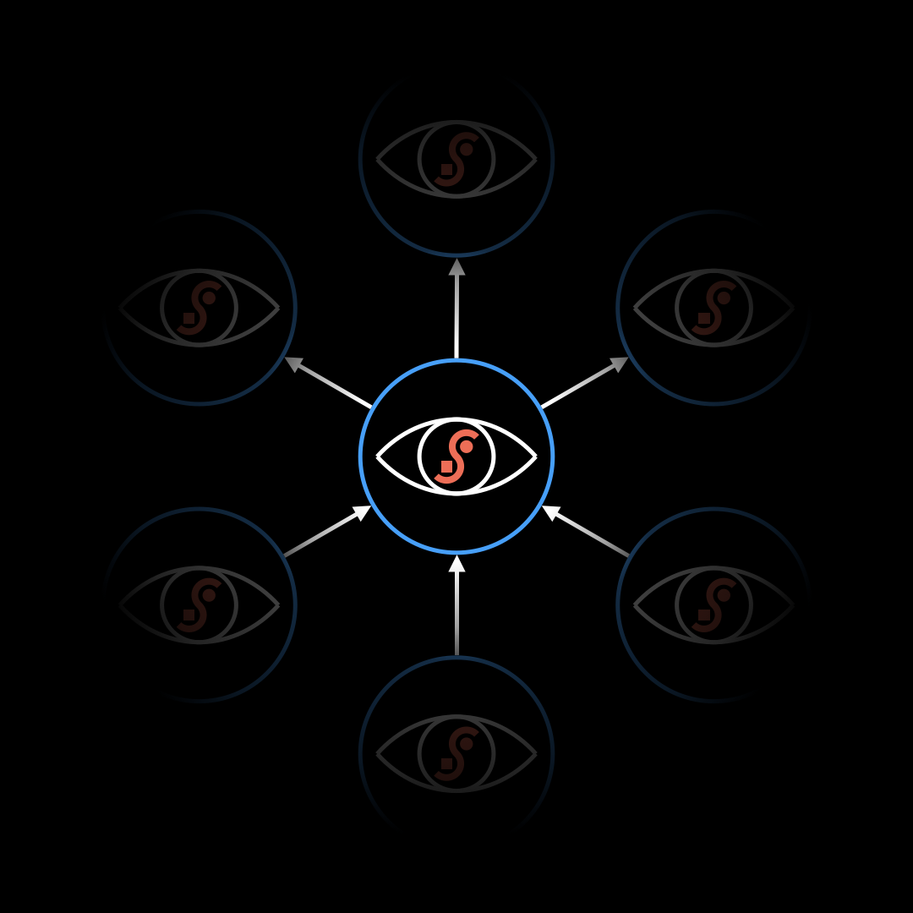

# DreamTalk

# DreamSong

# Description
The DreamNode represents the fundamental unit of ProjectLiminality
Technically it is implemented as a regular git repository with custom hooks to enable extended functionality including:
- super-module tracking
- sub-module synch

Every DreamNode minimally contains:
- a README file describing the idea it represents
- a DreamTalk file (png, gif, mp4) symbolically representing the idea
- a DreamSong file for weaving together text and DreamTalk into a linear storyline

# Perspectives
Each DreamNode can be used to aggregate conversation clips of the idea being expressed through the spoken word in free flowing conversation (DiaLogos) or in a stream of consciousness

Video/audio files can be stored in the DreamNode itself and linked directly:

< link to mp4 >

Or hosted through any other service and linked via an appropriate URL:

<iframe width="560" height="315" src="https://www.youtube.com/embed/VKFoSdBelvs?start=180&end=405" frameborder="0" allowfullscreen></iframe>

# Usage
Please replace the content of this README file with the description of your idea and a link to an appropriate DreamTalk symbol